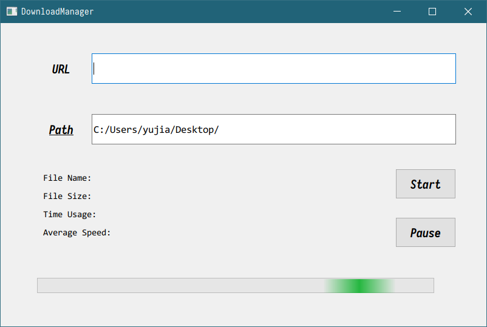
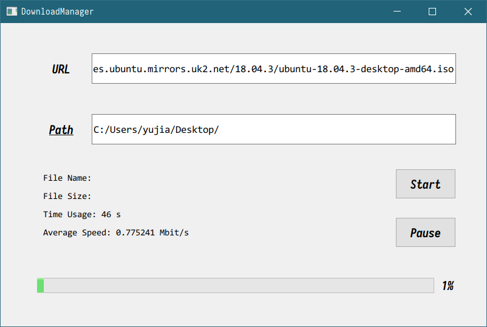
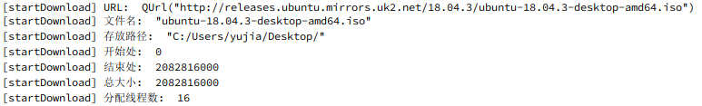

## HTTP 模块

### 功能

给定一个 URL，要能够下载这个 URL 所指定的文件到本地。

### 特性

多线程下载、断点续传

### 工作流程

1.  编写一个类 DownloadManager 对下载任务进行管理，它接收任务参数：URL、起点和终点，然后根据 URL 获取文件名、文件大小并手动配置下载路径，然后根据文件大小动态分配下载线程数、创建临时文件夹、创建下载线程。等到所有线程下载完毕后，再将所有临时文件合并。
2.  下载线程类 HttpDownloader 实现下载功能，它接收参数：URL、起点、终点、下载路径、文件名，然后创建临时文件、开始进行下载。下载使用到 QNetwork 模块提供的 QNetworkRequest 生成一次请求，使用 QNetworkAccessManager 管理请求，使用 QNetworkReply 获取请求的响应。

### 信号槽关联

1.  HttpDownloader 需要和 QNetworkReply 进行信号 - 槽的关联：由 QNetworkReply 发出 "准备好进行读取"、"读取完毕"、"读取进度更新"、"读取出错" 等信号，并由 HttpDownloader 接收并处理。
2.  DownloadManager 需要和 HttpDownloader 进行信号 - 槽的关联：由 DownloadManager 发出 "开始下载"、"暂停下载"、"继续下载"、"中止下载" 等信号，并由 HttpDownloader 接收并处理；此外，由 HttpDownloader 发出 "下载完毕"、"下载进度更新" 等信号，并由 DownloadManager 接收并处理。
3.  DownloadManager 需要和调用它的类进行信号 - 槽的关联：由 DownloadManager 发出 "下载完毕"、"下载进度更新" 等信号，并由调用类接收并处理。

### 具体实现

1.  多线程下载：首先根据文件大小确定线程的个数，然后创建相应个数的 HttpDownloader 实例，并将这些实例与 DownloadManager 进行信号槽的关联。
2.  断点续传：每次暂停下载时，读取当前文件大小并保存；等到继续下载时，将从 "起点 + 文件大小" 处继续下载。此外，如果关闭了程序，再重新申请同样的下载任务，则只要之前的临时文件未被删除，程序就可以找到这些临时文件并读取其大小，然后从此处继续下载。
3.  文件合并：先创建一个空的文件，然后依次打开临时文件，将其中的所有内容读入新文件中，并删除临时文件。
4.  更新下载进度参数：
    -   下载已用时间：使用一个计时器 QTimer，在下载期间计时，在非下载期间暂停计时；
    -   下载速度：每隔固定时间读取文件大小的差值，并计算这段时间内的平均速度；
    -   下载进度：读取文件大小，除以下载任务的总大小。

### 测试

<table>
    <tr>
        <td>UI 界面如右图所示，输入URL和Path后点击Start下载</td>
        <td></td>
    </tr>
</table>

<table>
    <tr>
        <td>开始下载后将会实时显示下载用时、下载速度和下载进度</td>
        <td></td>
    </tr>
    <tr>
        <td>控制台输出任务信息</td>
        <td></td>
    </tr>
</table>

<table>
    <tr>
		<td>暂停下载</td>
		<td></td>
	</tr>
    <tr>
        <td>下载完毕</td>
        <td></td>
    </tr>
</table>

### 个人感想

本次实验我学习了如何使用 Qt 预知的模块进行网络编程，同时对 Qt 的文件操作有了更深入的理解。

在 HTTP 通信中，需要时刻更新下载状态，这要求使用信号槽机制对 QNetworkReply、HttpDownloader、DownloadManager 以及调用者之间实现各种连接，以达到同步状态的目的。

在处理文件时，要注意对资源的申请、释放等时机的调整，避免出现冲突导致程序卡住；此外还需要注意避免空指针的问题，若未能成功申请到资源，却继续进行处理，就会很容易产生指针错误。这些问题的解决办法是做好错误检测，要在资源分配时检查状态，确保操作是有效的。

此外，此次实验我个人的任务是写一个模块供其他程序使用，所以需要设计好接口，尽量将模块与外部的耦合降到最低，以减少程序的不稳定性，也便于调试。

