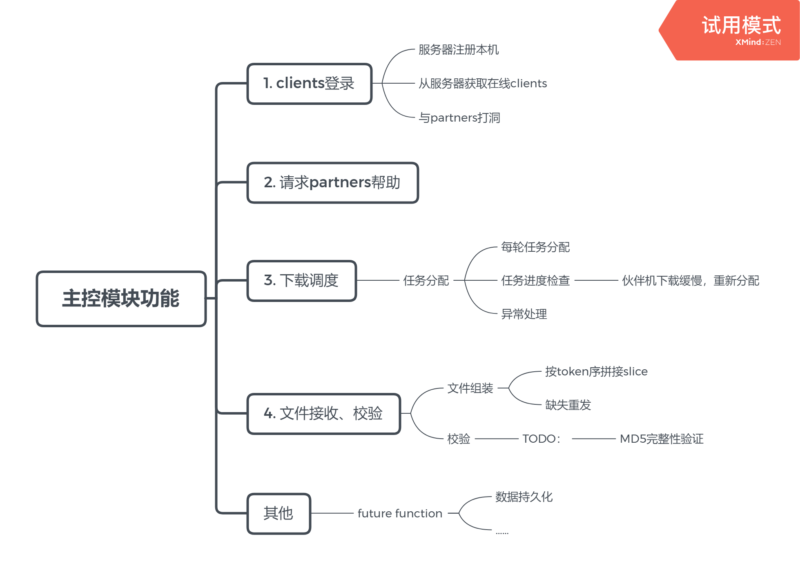
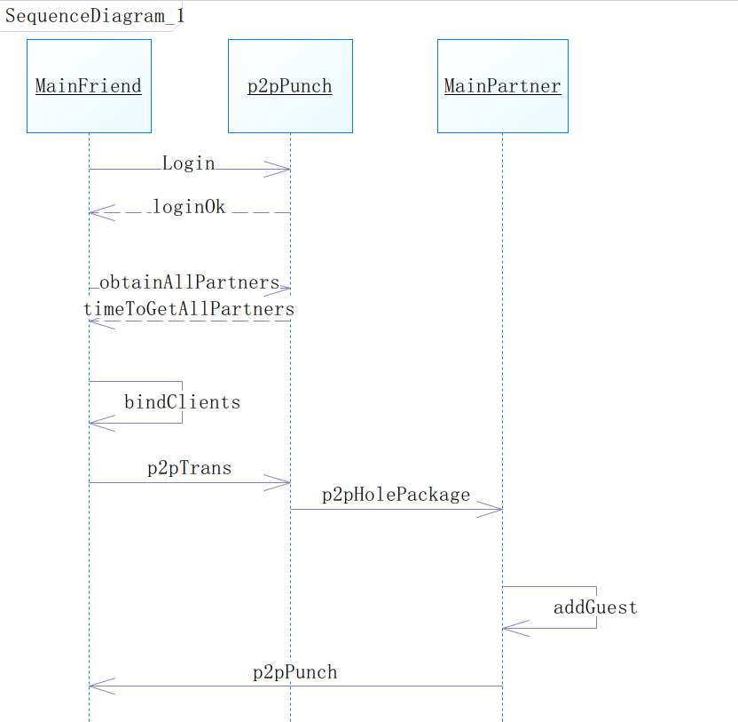
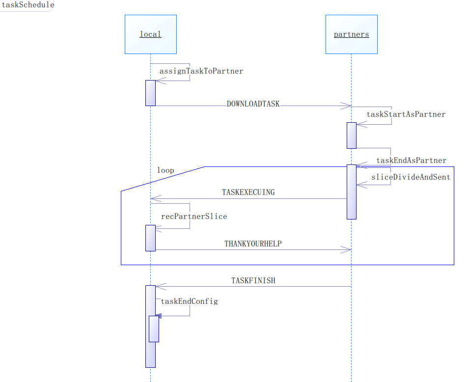

# 控制调度模块
## 0. 命名约定
> 主体相关
 * Client 客户机
 * Server 服务器
 * 朋友 主动要求下载的客户端
 * 伙伴 被动协助下载的客户端
 * Host 主动监听端口，接收多个伙伴客户端访问的的TcpServer对象
 * Guest，向某一个朋友客户端发送信息的TcpSocket对象
 
 > 下载文件相关
 * Mission 本次要下载的文件
 * Task client被分配到的任务，每个Task为n倍Block Size
 * Block 主控模块划分任务的最小单位
 * Slice 伙伴机向朋友机发送Task时，受TCP限制而进行的文件分片
 * token 任务令牌，任务的唯一标识
 * index 任务等待P2P传送的文件分块后，块的唯一标识

## 1. 模块功能概述
`MainCtrl` 作为*P2PDownload*的核心，综合调用着各个工具类，实现下图所示功能。

其中，根据user使用软件时的初衷不同，划分为`friend`/`partner`两种角色，分别实现**主动请求、分配下载mission**/**协助friend下载mission**功能。

    
## 2. 实现细节

### 2.1 模块类图

控制调度模块使用的核心类如下图：

  
> 其中，由于每个类的方法、属性较多，不一一展示。

### 2.2 登录通信
`client`登录阶段，主要通过使用`UDPSocketUtil`类实例与服务器通信。
具体实现了下述功能：
1. 在服务器中注册本机信息
2. 调用`obtainAllClients`方法，获取服务器中存储的`clients`，建立`existClients` 向量，用于后继下载调度
3. 由于公网时clients可能在不同的*NAT*后，故此时打洞建立*TCP连接*。

通信时序图如下：


### 2.3 任务分发
如何处理调度各个`client`间的下载任务是个复杂的问题，本项目自主设计了一个很直观、简单的调度算法。
主要流程，即通过将下载的`Mission`分成任务块`block`队列，让每个`client`按照自身下载能力领取相应块数的`task`进行下载；通过维护`waitingClient`队列及`taskTable`来管理可进行中的任务`task`及主机；此外，还对下载超时等异常任务进行检测。

#### 2.3.1 算法流程图


#### 2.3.2 相关
宏：
- `MAXBLOCKSIZE`:单个文件块大小上限
- `INITRATE`:初始下载速度
- `DDL`:任务下载时长上限

变量:
-  `fileSize`:待下载任务文件大小
- `blockSize`：单个任务块大小
- `hostWaitPQ`:空闲主机队列 
- `hostNum`:主机个数
- `blockAssignedNum`:每个主机被分配下载的任务块数量

#### 2.3.3 初始化

1. 获取`fileSize`
2. 初始化`hostNum`
3. 任务块大小初始化（阈值与协作`clients`数的平衡）
``` python
temp=fileSize/hostNum
blockSize= temp if temp<MAXBLOCKSIZE else MAXBLOCKSIZE
``` 
4. 建立`waitingClients`队列
    > 其中，`blockAssignedNum`=2*`blockSize`
    `partner`初始下载速度为`INITRATE`，任务发起机`friend`为2*`INITRATE`，

#### 2.3.4 任务块队列创建
根据`blockSize`划分出的任务块`block`队列，供随后的下载机`client`领取。

#### 2.3.5. 异常检测
任务分配表`taskTable`中每项进行的任务`task`都设置了倒计时。  
超时则唤醒对应处理函数，与`partner`通信，以决定是等待该`partner`继续执行下载或是取消当前任务。

### 2.4 下载通信
`partner`的`task`下载完成后，向`friend`发送文件的过程。
由于*TCP*单次传输流的长度限制，需要将`task`切分为若干`slice`进行发送。关于`slice`的调度处理由`partner`对象的`sliceAndSent`实现调度。

时序图如下：


# UI设计与未来完善
由于尚未开发完成，当前阶段的UI设计是面向调试的，用户体验差。待功能开发完成后，将继续完善UI的可用性与美观性。
