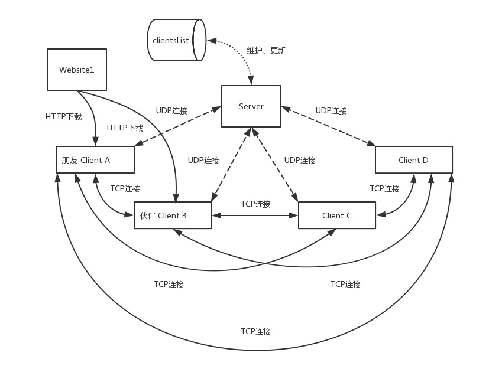
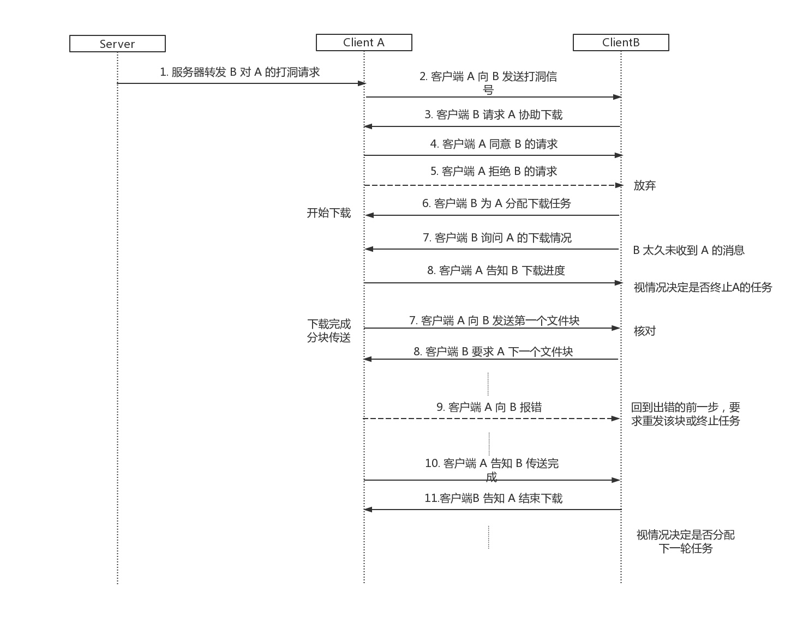

# 三、P2P通信子模块原理及实现  

<nav>
<a href="#31 介绍">3.1 介绍</a> 
<a href="#32 模块总体架构">3.2 模块总体架构</a> 
<a href="#33 服务器和客户端的UDP通信">3.3 服务器和客户端的UDP通信</a> 
&nbsp;&nbsp;&nbsp;&nbsp;<a href="#331 控制消息">3.3.1 控制消息</a> 
&nbsp;&nbsp;&nbsp;&nbsp;<a href="#332 客户端信息列表的数据结构">3.3.2 客户端信息列表的数据结构</a> 
<a href="#34 客户端之间的TCP通信">3.4 客户端之间的TCP通信</a> 
&nbsp;&nbsp;&nbsp;&nbsp;<a href="#341 朋友角色对应的TCP连接">3.4.1 朋友角色对应的TCP连接</a> 
&nbsp;&nbsp;&nbsp;&nbsp;<a href="#342 伙伴角色对应的TCP连接">3.4.2 伙伴角色对应的TCP连接</a> 
&nbsp;&nbsp;&nbsp;&nbsp;<a href="#343 控制消息">3.4.3 控制消息</a> 
&nbsp;&nbsp;&nbsp;&nbsp;<a href="#344 下载任务的标识">3.4.4 下载任务的标识</a> 
<a href="#35 P2P子模块和主控模块的交互 ">3.5 P2P子模块和主控模块的交互 </a> 
<a href="#36 一些困难">3.6 一些困难</a> 
&nbsp;&nbsp;&nbsp;&nbsp;<a href="#361 负载过大">3.6.1 负载过大</a> 
&nbsp;&nbsp;&nbsp;&nbsp;<a href="#362 指针的管理困难">3.6.2 指针的管理困难</a> 
</nav>

## 3.1 介绍
P2P通信子模块实现了协同下载的关键功能，利用伙伴客户端的协助达到分布式下载的效果，能有效提升下载的吞吐率。  

## 3.2 模块总体架构

P2P通信子模块由单个服务器和多个客户端组成：
- **服务器**：
  1. 负责统一存储、分发当前在线的`客户端信息`，需要处理客户端登录、退出、返回客户端信息列表等业务。  
  2. 它同时还作为`客户端打洞`的中介，服务器S在公网上有一个IP，两个私网分别由NAT-A和NAT-B连接到公网，NAT-A后面有一台客户端A，NAT-B后面有一台客户端B，现在，我们需要借助S将A和B建立直接的TCP连接，即由B向A打一个洞，让A可以沿这个洞直接连接到B主机，就好像NAT-B不存在一样。  
   
- **客户端**：
  1.  客户端有两个角色，`朋友角色`意指主动要求下载的客户端，`伙伴角色`则意味着被动协助下载的一方。由于角色的分配只针对某一个具体的下载，所以每台客户端既可以是“朋友”、也可以是“伙伴”，还可以兼而有之。
  2.  朋友角色：负责下载子任务的分发以及目标文件块的接收，通过和主控模块的交互，实现下载的目标文件组装。
  3.  伙伴角色：负责下载子任务的执行以及目标文件块的发送，通过和主控模块的交互调用HTTP下载子模块完整下载。
   
## 3.3 服务器和客户端的UDP通信
服务器和客户端的通信具有格式简单、交互频率低、报文长度短的特点，因此采用UDP通信协议。  

  

### 3.3.1 控制消息
服务器和客户端的通信设置了枚举类型 UDPCtrlMsgType：  

| 类型 | 作用 |
| :------: | :------: |
| LOGIN |客户端信息注册到服务器 |
| LOGOUT | 服务器上客户端信息清空 |
| RENAME | 客户端设置的主机名不允许重复 |
| LOGINSUCCESS | 客户端登陆成功 |
| LOGINFAILURE | 客户端登陆失败 |
| LOGOUTSUCCESS | 客户端登出成功 |
| LOGOUTFAILURE | 客户端登出失败 |
| OBTAINALLPARTNERS | 客户端申请获取伙伴客户端信息 |
| OBTAINSUCCESS | 客户端申请获取伙伴客户端信息成功 |
| OBTAINFAILURE | 客户端申请获取伙伴客户端信息失败 |
| RETURNALLPARTNERS | 服务器返回伙伴客户端信息 |
| P2PTRANS | 请求服务器“打洞” |
| P2PHOLEPACKAGE | 服务器向客户端发送，要求此客户端发送UDP打洞包 |

### 3.3.2 客户端信息列表的数据结构
客户端以朋友角色参与TCP通信时需要开放一个端口监听伙伴客户端的请求，因此客户端信息列表的结构体如下：  

| 字段 | 解释 |
| :------: | :------: |
| name |客户端主机名 |
| pwd |客户端口令 |
| ip |客户端公网ip |
| udpPort |客户端和服务器通信的端口 |
| port | TCP通信时作为朋友角色使用的host端口（下一节介绍） |
| filePort |TCP通信时作为朋友角色使用的fileHost端口（下一节介绍） |

## 3.4 客户端之间的TCP通信
客户端通信时会建立`TCP长连接`，当且仅当下载任务完成或发送错误时才会断开，并进行善后工作释放资源。  
客户端在作为朋友角色或伙伴角色、传输普通协调消息和下载文件块时需要建立不同的Socket对象。

  

### 3.4.1 朋友角色对应的TCP连接
- **host**：QTcpServer对象，监听伙伴客户端发来的TCP连接请求。
- **fileHost**：QTcpServer对象，监听伙伴客户端发来的TCP连接请求。
-  **partnerConnections**：QTcpSocket对象，host监听到伙伴客户端的请求后建立。伙伴客户端和该Socket对象一一对应，是通信双方沟通的主要途径。  
-  **partnerFileConnections**：QTcpSocket对象，fileHost监听到伙伴客户端的请求后建立。仅用于下载文件块的接收。

### 3.4.2 伙伴角色对应的TCP连接
- **guests**：QTcpSocket对象，和朋友客户端通信的Socket对象列表，每一次打洞成功，都会添加新元素。
- **fileGuests**：QTcpSocket对象，向朋友客户端发送下载文件块的Socket对象列表，每一次打洞成功，都会添加新元素。

### 3.4.3 控制消息
为朋友客户端和伙伴客户端的协调下载设计了枚举类型 TCPCtrlMsgType：  

| 类型 | 作用 |
| :------: | :------: |
| P2PPUNCH | 伙伴客户端发送的打洞包，接收端应忽略此消息 |
| AREYOUALIVE | 朋友客户端询问伙伴客户端是否存活 |
| ISALIVE | 伙伴客户端确认存活 |
| ASKFORHELP | 朋友客户端请求伙伴客户端协助下载 |
| AGREETOHELP | 伙伴客户端同意协助下载 |
| REFUSETOHELP | 伙伴客户端拒绝协助下载 |
| DOWNLOADTASK | 下载任务信息 |
| TASKFINISH | 伙伴客户端通知朋友客户端下载任务执行完成 |
| TASKEXECUING | 伙伴客户端通知朋友客户端下载任务正在执行 |
| TASKFAILURE | 伙伴客户端通知朋友客户端下载任务执行失败 |
| RETURNALLPARTNERS    | 服务器返回伙伴客户端信息 |
| ABORTTASK | 朋友客户端通知伙伴客户端终止并清除当前下载任务 |
| THANKYOURHELP | 朋友客户端通知伙伴客户端已经收到传送的文件 |
| ENDYOURHELP | 朋友客户端通知伙伴客户端已终止 |

### 3.4.4 下载任务的标识
下载任务由其TOKEN唯一指定，TOKEN由主控模块分配

## 3.5 P2P子模块和主控模块的交互 
P2P子模块和主控模块的交互基于QT的信号槽机制，可以方便地进行异步操作。  
P2P子模块的主要功能是动态地建立和关闭UDP连接、TCP连接，并进行消息的发送、接收。成功解析消息的类型后会发送相关信号，告知主控模块进行相应的处理。主控模块也会在适当的时候发送信号或调用该模块的函数进行一系列操作。

## 3.6 一些困难

### 3.6.1 负载过大
朋友客户端在进行本机多线程下载的同时会和大量的伙伴客户端进行交互，下载大文件的时候，网络的传输负载还是很大的。此外频繁的文件读写也会导致内存、磁盘高负荷使用。

### 3.6.2 指针的管理困难
受困于初期架构的不甚清晰以及和主控模块交互的耦合，第一轮迭代的代码结构比较凌乱。P2P通信环节会创建大量的网络连接，同时也意味着大量的指针，网络连接的出错和主动断开经常要求我们释放指针。但信号槽函数的异步处理可能会带来一些意想不到的空指针错误。