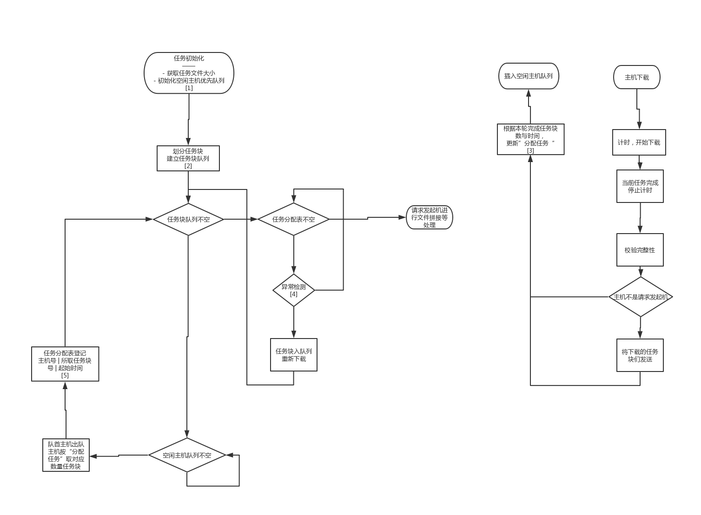

# 任务分发算法


# 0. 相关
宏：
- `MAXBLOCKSIZE`:单个文件块大小上限
- `INITRATE`:初始下载速度
- `DDL`:任务下载时长上限

变量:
-  `fileSize`:待下载任务文件大小
- `blockSize`：单个任务块大小
- `hostWaitPQ`:空闲主机队列 //qt无优先队列，未来更新自己重写的优先队列 按照下载速度排序
- `hostNum`:主机个数
- `blockAssignedNum`:每个主机被分配下载的任务块数量

## 1. 初始化

1. 获取`fileSize`
2. 初始化`hostNum`
    
3. 任务块大小初始化
``` python
temp=fileSize/hostNum
blockSize= temp if temp<MAXBLOCKSIZE else MAXBLOCKSIZE
``` 
4. 建立`hostWaitPQ`
    > 其中，`blockAssignedNum`=2*`blockSize`
    伙伴机初始下载速度为`INITRATE`，任务发起机为2*`INITRATE`，

## 2. 任务块队列创建
根据`blockSize`，创建等个数的任务块队列（逻辑上的队列，实现时数据结构待议，数组似乎足矣）

## 3. 根据完成时间调整`blockAssignedNum`
// TODO:待实测速度后设计

## 4. 异常检测
查任务分配表种正在进行的任务，检测是否有主机下载时间超过`DDL`
若有，检测该主机是否存活。
使用QTimer实现，设定TimeOut检测

## 5. 任务分配表登记


